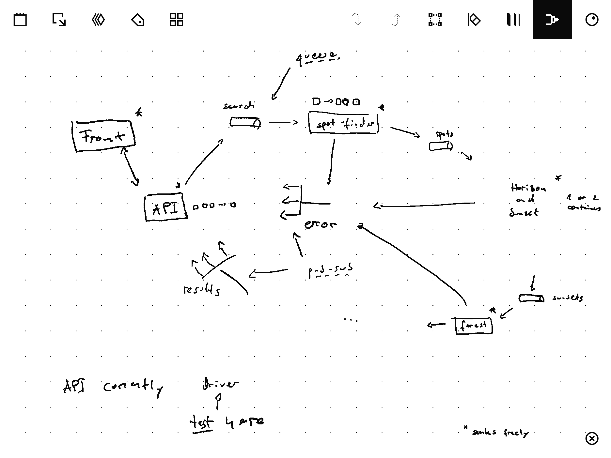

# Sunangel Home Edition

## Planned Architecture

### Rationale

- `spot-finder` creates many messages from one request (one message per found location)
- `API` has to gather all messages that belong to the same request
- requests identified w/ UUID

Only API component has state.
All other components can scale horizontally w/o restrictions.
[Queues](https://en.wikipedia.org/wiki/Message_queue) used for communication for free load balancing ([competing consumer](https://learn.microsoft.com/en-us/azure/architecture/patterns/competing-consumers)).

In order to allow `API` component to scale, use [publish-subscribe](https://learn.microsoft.com/en-us/azure/architecture/patterns/publisher-subscriber) for relaying responses to the `API` components.
