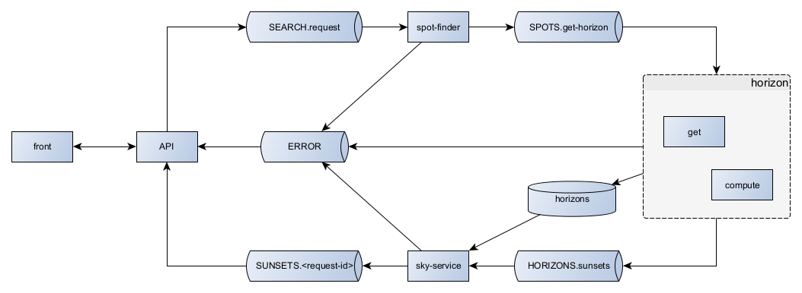

# Sunangel Home Edition


[[](https://github.com/sunangel-project/Sunangel/actions/workflows/pipeline.yml)](https://github.com/sunangel-project/Sunangel/actions/workflows/pipeline.yml)
[](https://sunn.cloudsftp.de)

## Execution

### Backend

Run with [dagger](https://dagger.io)

``` sh
dagger call local-manual-testing --source=. up --ports=6660:6660
```

### Frontend

Currently, it is not in the `docker-compose.yml` file.
Run with `npm` or `bun`.

```
cd front
npm install # only needed once
npm run dev
```

You can also compile it to `html` and `javascript`.

```
cd front
bun run build
```

## Architecture



For details regarding the horizon group, check [horizon](horizon).

### Rationale

- `spot-finder` creates many messages from one request (one message per found location)
- `API` has to gather all messages that belong to the same request
- requests identified w/ UUID

Only API component has state.
All other components can scale horizontally w/o restrictions.
[Queues](https://aws.amazon.com/message-queue/) used for communication for free load balancing ([competing consumer](https://learn.microsoft.com/en-us/azure/architecture/patterns/competing-consumers)).

The API component does not follow the competing consumers pattern.
Rather, any instance listens only to the subjects related to the requests it sent out on the `RESULTS` stream, as well as on the `ERRORS` stream.
 
