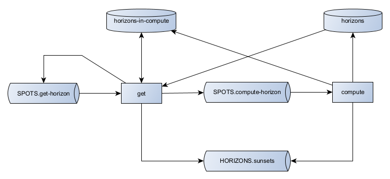
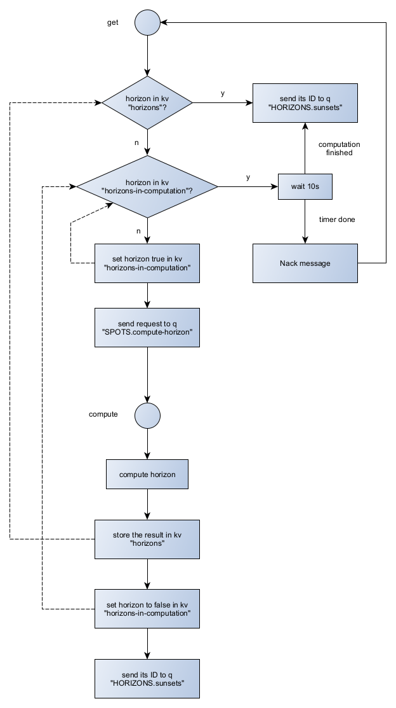

# Horizon

Components managing the computation of horizons.
Two components to bypass the long computation process for already computed horizons.

## Architecture

## Behavior

The resulting horizon is stored in the key-value-store "horizons" and only the id of the horizon is passed to the queue "HORIZONS".
This reduces the size of outgoing messages.
The pattern used here is the [Claim-Check pattern](https://www.enterpriseintegrationpatterns.com/patterns/messaging/StoreInLibrary.html).

A more detailed view of the inner workings is displayed in the following diagram.

In case the horizon is already being computed, and the timer finishes before the horizon is ready, the request is requeued again.
This avoids requests getting lost when the component horizon-get crashes during the timer period.
